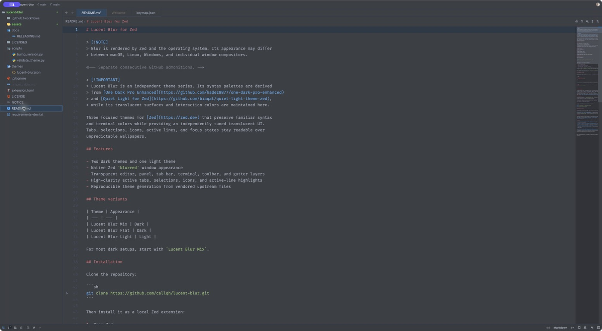
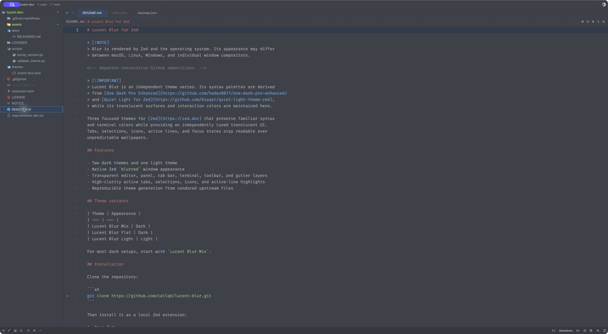
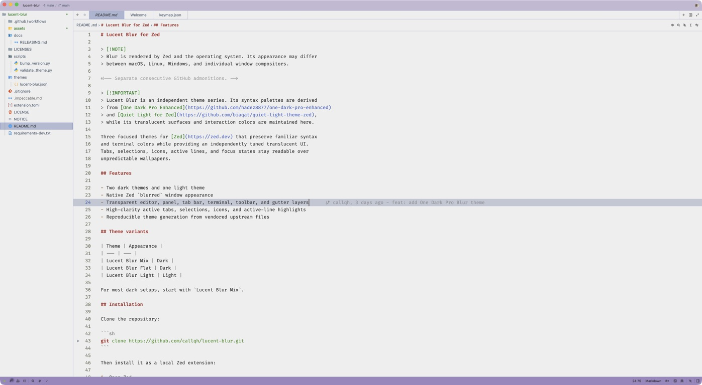

# Lucent Blur for Zed

> [!NOTE]
> Blur is rendered by Zed and the operating system. Its appearance may differ
> between macOS, Linux, Windows, and individual window compositors.

<!-- Separate consecutive GitHub admonitions. -->

> [!IMPORTANT]
> Lucent Blur is an independent theme series. Its syntax palettes are derived
> from [One Dark Pro Enhanced](https://github.com/hadez8877/one-dark-pro-enhanced)
> and [Quiet Light for Zed](https://github.com/biaqat/quiet-light-theme-zed),
> while its translucent surfaces and interaction colors are maintained here.

Three focused themes for [Zed](https://zed.dev) that preserve familiar syntax
and terminal colors while providing an independently tuned translucent UI.
Tabs, selections, icons, active lines, and focus states stay readable over
unpredictable wallpapers.

## Features

- Two dark themes and one light theme
- Native Zed `blurred` window appearance
- Transparent editor, panel, tab bar, terminal, toolbar, and gutter layers
- High-clarity active tabs, selections, icons, and active-line highlights
- Three curated variants in a single, easy-to-maintain theme file

## Theme variants

| Theme | Appearance |
| --- | --- |
| Lucent Blur Mix | Dark |
| Lucent Blur Flat | Dark |
| Lucent Blur Light | Light |

For most dark setups, start with `Lucent Blur Mix`.

## Previews

### Lucent Blur Mix



### Lucent Blur Flat



### Lucent Blur Light



## Installation

Clone the repository:

```sh
git clone https://github.com/callqh/lucent-blur.git
```

Then install it as a local Zed extension:

1. Open Zed.
2. Open the Extensions page.
3. Select **Install Dev Extension**.
4. Choose the cloned `lucent-blur` directory.
5. Open the theme selector and select a theme beginning with `Lucent Blur`.

You can also run `zed: install dev extension` from the command palette.

After changing theme files locally, run `zed: rebuild dev extension` to reload
the installed development extension.

## Recommended settings

Disable project-panel sticky scroll to prevent its overlay from interrupting
the transparent panel surface:

```json
{
  "project_panel": {
    "sticky_scroll": false
  }
}
```

You can select the recommended dark theme directly in Zed settings:

```json
{
  "theme": "Lucent Blur Mix"
}
```

## Compatibility

The theme controls color and transparency, but Zed and the operating system
provide the final blur effect. Systems without supported window composition may
show transparency without blur or render an opaque fallback.

If the theme loads but does not blur, verify your OS transparency settings and
check the [Zed issue tracker](https://github.com/zed-industries/zed/issues).

## Development

The canonical theme file is `themes/lucent-blur.json`. It contains Mix and Flat
for dark appearance, plus Light for bright environments.

When tuning the themes, keep source syntax and terminal colors intact and focus
Lucent-specific changes on translucent surfaces, tabs, selections, icons,
focus borders, and editor-line hierarchy.

Validate changes against Zed's official theme schema:

```sh
python -m pip install -r requirements-dev.txt
python scripts/validate_theme.py
```

### Automated releases

GitHub Actions validate every change, create versioned GitHub Releases, and
open Zed extension store update pull requests.

See [Releasing Lucent Blur](docs/RELEASING.md) for repository settings,
the required `COMMITTER_TOKEN`, initial store publication, and release steps.

## License

This project retains the Apache License 2.0 used by One Dark Pro Enhanced.
Quiet Light is used under the MIT License. See [LICENSE](LICENSE),
[NOTICE](NOTICE), and [LICENSES](LICENSES) for terms, attribution, and a
summary of modifications.

## Credits

- [One Dark Pro](https://github.com/Binaryify/OneDark-Pro) by Binaryify for the
  original One Dark Pro theme.
- [One Dark Pro Enhanced](https://github.com/hadez8877/one-dark-pro-enhanced) by
  Hadez for the Zed color themes used as this project's foundation.
- [Quiet Light for Zed](https://github.com/biaqat/quiet-light-theme-zed) by
  blaqat for the Quiet Light palette and syntax colors.
- [Zed](https://github.com/zed-industries/zed) for native transparent and blurred
  theme support.

Special thanks to [Jens Lystad](https://github.com/jenslys) and
[Catppuccin Blur for Zed](https://github.com/jenslys/zed-catppuccin-blur).
Its thoughtful approach to blurred Zed surfaces, recommended settings, and
upstream-driven generation directly inspired this project.

---

Built with appreciation for the One Dark Pro, Quiet Light, Catppuccin, and Zed
communities.
